# COMP2042_CW_JunYuan
## Maintainance made to Frogger game

## Maintainance 
### 1. Refactor of naming
    - Class name are rename
        - Example: Obstcale.java -> Vehicle.java, Animal.java -> Frog_player.java
    - Variable & method name are changed to make it maeningful
    - Snake case is used as case style
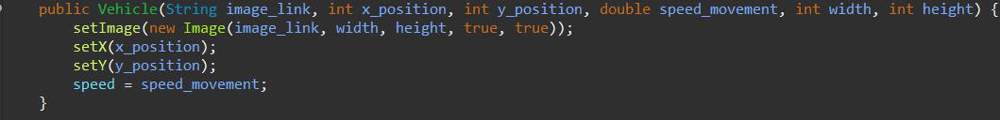   

### 2. Comments 
    - Javadoc auto documentation (Developers can read the documentation to understand the code better)
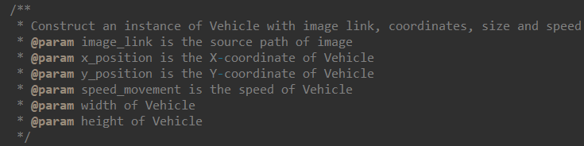 

    - Comment added at end of complex code
   

### 3. Image
    - Image source name is changed (Make it meaningful)
        * Example: iKogsKW.png -> game_back_image.png
    - Correct image links which are wrongly defined
    - Image links are factorise into string variables (Easier modification to image link)
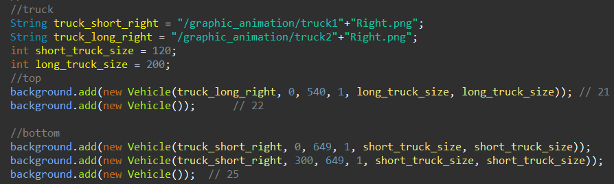   

### 4. Remove unused code commented by previous programmer
    - To make code tidier and less disruption while coding

### 5. Refactor of method
    - Remove the the part where animations are created in the main.java file into another class called Create_animations
        - Reduce length of code in main.java
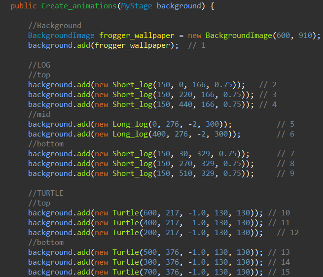   

#### 6. Animation
    - Size of animation are adjusted to make GUI better
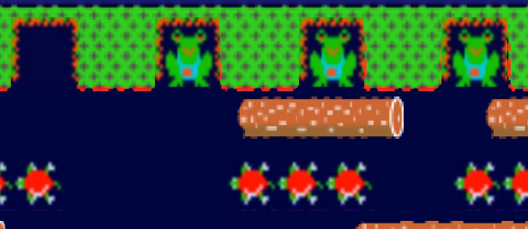   

    - Background image is edited
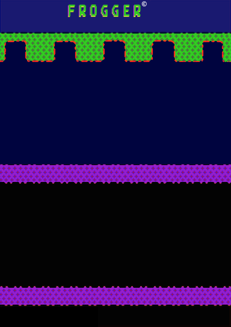          

///////////////////////////////////////////////////////

## Extension
* start screen
* info screen
* High Score pop up 
* permanent high score list 
* Add levels
* junit
* maven implement 

#### 1. Start Screen
        - Start Page Overall
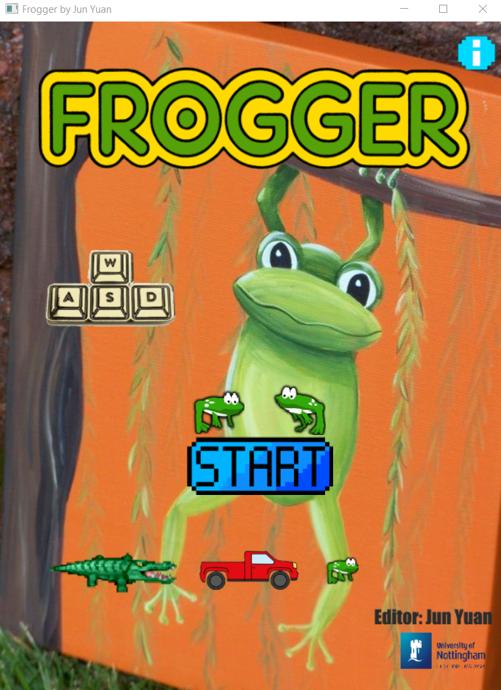   

        - Enter Game Button 
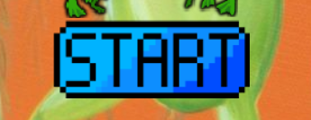      

        - Info Page Button 
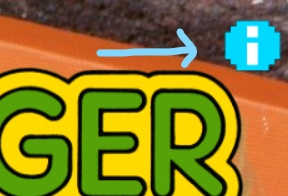     

        - Instruction Button 
            - Alert will pop up
     

        - Animations
            - Moveable
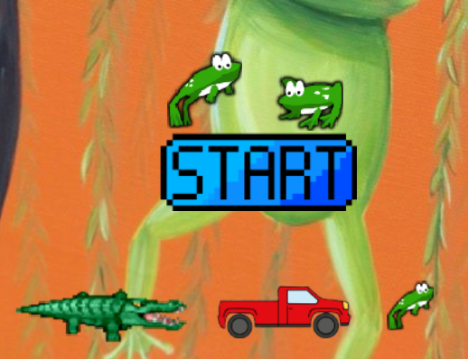     

#### 2. Information Screen
        - Info Page Overall
            - Text are stored in text file called frogger_info.txt
            - Details about game operation
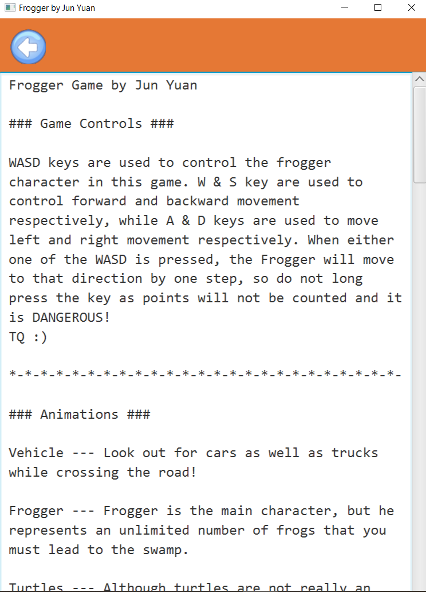  

        - Back button 
            - Back to start screen
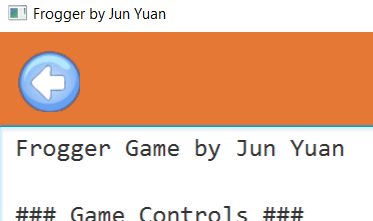  

#### 3. Game Screen
        - Game Page Overall
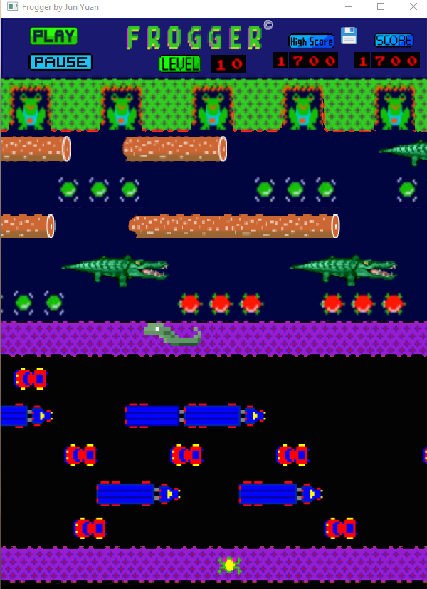  

        - Play & Pause Button
            - Will stop and resume game timer
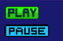  

        - Current Level Display
            - Will update according to player's current level
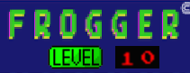  

        - High Score
            - Everytime game start it will be reset to zero
            - Will update live according to player current high score
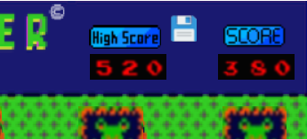  

            - High Score is pressable button
                - Alert will pop up
                - To view current high score list
                - Will be updated when save button is press
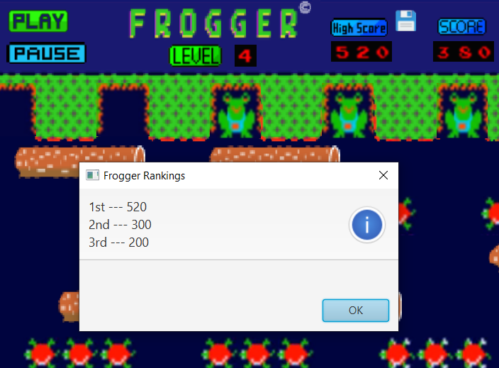  

        - Save button
            - Alert will pop up
            - It will update the high score list according to the rank if the current high score is greater than scores in high score list else it will reject the update of high score list 
  

**Save condition** 
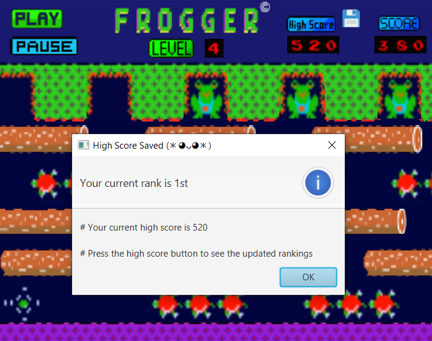  

**Unsave condition** 
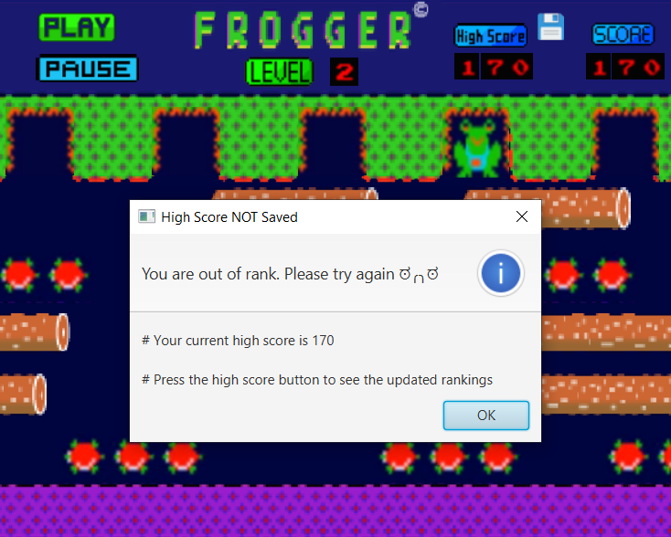  

        - Game Levels Implemented
            - Total 10 levels as each time frog lands on the goal the level will increase by one.
            - As level get higher, the animation becomes faster & more complex.
            - New animation added: crocodiles and snakes
            - Details of game level can be read in information screen.

**Crocodiles** 
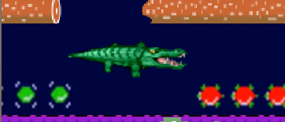 

**Snakes** 
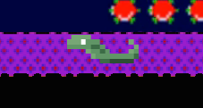  

#### 4. Maven Implementation
        - Converted initial project to Maven project
        - Added dependencies for Javafx (Does not need to import library from Javafx)

///////////////////////////////////////////////////////////////////

5. Remove unnecessary expression as parameters
    - Remove meaningless expression when creating an instance of "End" object and replace it with answer(int) after evaluating.
    - Less confusion and simplify the code

6. Throws IllegalStateException
    - Added to start method in main.java .
    - To prevent method has been invoked at an illegal or inappropriate time.

11. Files are categorize into different package
    - Java files moved to newly created package accordingly 
        - Package created: All_animation, All_button, Files_IO
    - Images and music source are moved to another folder
        - Files created: Files, graphic_animation, frogger_music
    - Part of refactor process to manage all files better instead of clumping everything in one package
            