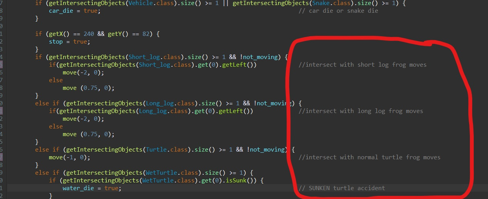

# COMP2042_CW_JunYuan
## Maintainance made to Frogger game

# Version 2
## Maintainance 
### 1. Refactor of naming
    - Class name are rename
        - Example: Obstcale.java -> Vehicle.java, Animal.java -> Frog_player.java
    - Variable & method name are changed to make it maeningful
    - Snake case is used as case style

### 2. Comments 
    - Javadoc auto documentation (Developers can read the documentation to understand the code better)

    - Comment added at end of complex code
 

### 3. Image
    - Image source name is changed (Make it meaningful)
        * Example: iKogsKW.png -> game_back_image.png
    - Correct wrongly image links which are wrongly defined
    - Image links are factorise into string variables (Easier modification to image link)
 

### 4. Remove unused code commented by previous programmer
    - To make code tidier and less disruption while coding

### 5. Refactor of method
    - Remove the the part where animations are created in the main.java file into another class called Create_animations
        - Reduce length of code in main.java
 

#### 6. Animation
    - Size of animation are adjusted to make GUI better
    

    - Background image is edited
        

## Extension
* start screen
* info screen
* High Score pop up 
* permanent high score list 
* Add levels
* junit
* maven implement 

///////////////////////////////////////////////////////////////////

5. Remove unnecessary expression as parameters
    - Remove meaningless expression when creating an instance of "End" object and replace it with answer(int) after evaluating.
    - Less confusion and simplify the code

6. Throws IllegalStateException
    - Added to start method in main.java .
    - To prevent method has been invoked at an illegal or inappropriate time.

11. Files are categorize into different package
    - Java files moved to newly created package accordingly 
        - Package created: All_animation, All_button, Files_IO
    - Images and music source are moved to another folder
        - Files created: Files, graphic_animation, frogger_music
    - Part of refactor process to manage all files better instead of clumping everything in one package

12. Added animations
    - One more row of cars is added to make a total of 5 lanes of vehicle
    - To make game more complicated as well as to make use of empty space of the scene

### Extension

1. Menu page created (Start scene)
    - To make game more completed 
        - Class created: Menu_info_page.java, Menu_page
        - Scene is set to start scene before player will be able to play game
        - Simple WASD control instruction is added
        - Buttons added: Start game button, info button
            - Start button will set the scene to game scene
            - Info button will set scene to info scene

2. Info Page created (Info scene)
    - To understand more about the game 
        - Class created: Menu_info_page.java, Info_page, Info_text
        - Buttons added: Back button
            - Back button will set scene to start scene
        - Textarea was used to display the game operations and instructions
            - All text from textarea are stored in a text file

3. Button
    - Button for all scene was created in a seperate class
        - Button are formed from images
        - Buttons have transparent background
        - Button will form shadow when cursor is on button
            - Better visual effect 

4. HighScore
    - High score system added to game 
        - Score stored in text file (read write method)
        - Updated with timer
    - High score animation in game is a button
        - Alert is produce when high score button is press
            - Alert list of previous high score list (top 3)

# Image

            